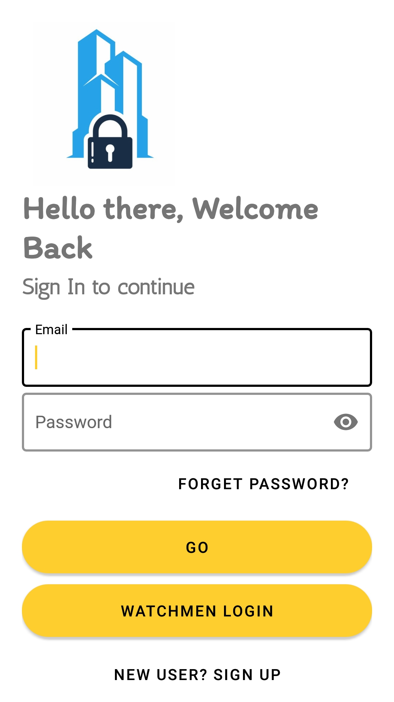

# SecureBuilding
It is an residential building management android app which facilitate residents to approve or reject visitors at real time,
without the need for them to enter the premises of building .It allows to read all the notices send by the secretary of
building. It allows watchmen to send alert to owner if his vehicle is not alligned properly.

<table>
  <tr>
    <td>Splash Screen</td>
     <td>Login Page</td>
     <td>Dashboard</td>
  </tr>
  <tr>
    <td></td>
    <td></td>
    <td></td>
  </tr>
  
  <tr>
    <td>Residents</td>
     <td>Notice Board</td>
     <td>Sent Notice</td>
  </tr>
  <tr>
    <td></td>
    <td></td>
    <td></td>
  </tr>
  <tr>
    <td>Emergency Contacts</td>
     <td>Watchmen Login</td>
     <td>Watchmen Dashboard</td>
  </tr>
  <tr>
    <td></td>
    <td></td>
    <td></td>
  </tr>
   <tr>
    <td>Parking Problem</td>
  </tr>
  <tr>
    <td></td>
  </tr>
 </table>
